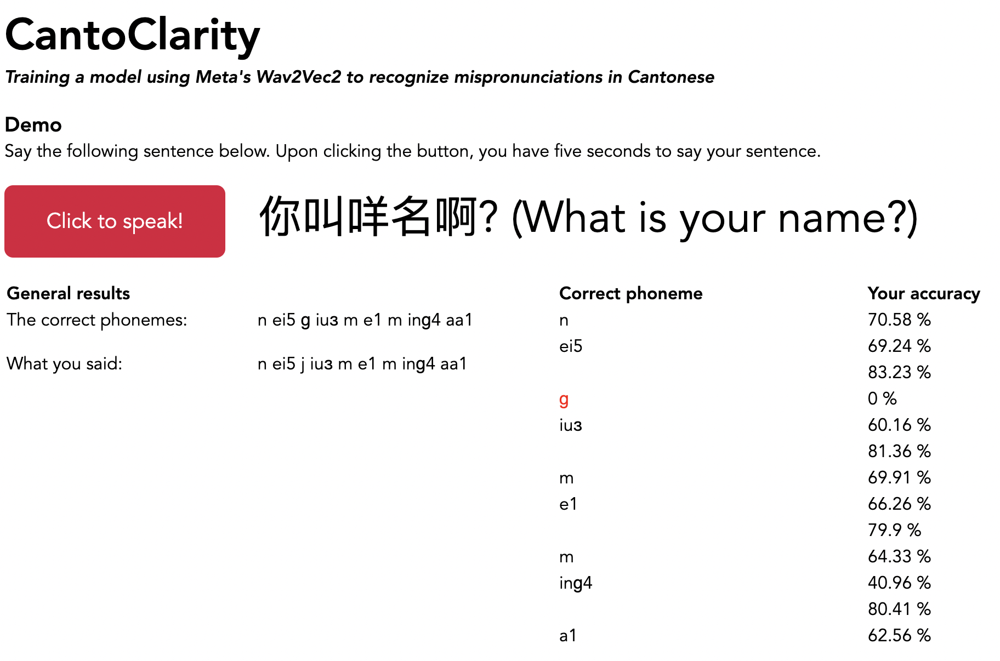

# CantoClarity

#### Training a model using Meta's Wav2Vec2 to recognize mispronunciations in Cantonese

## Motivation
My Cantonese is worse than it should be for someone who grew up in Hong Kong. I'm okay at conversing,
but have always wondered if there was a way to use coding to improve my pronunciation. It turns out there
<em>is</em> a way — I've trained a model to recognize phoneme-level mispronunciations in Cantonese. Although
it's obviously imperfect (there are many other factors that affect pronunciation), it's a start. I
use this as a tool to improve my own pronunciation, and hope others to do the same.

## Sample Results


## Installation
Clone the repo by the following:
```
git clone https://github.com/briyanchiyang/cantonese.git
```

Install the required dependencies. Since many of the packages are quite specific, it's recommended to use a virtual environment to store all of these.
```
pip install -r requirements.txt
```

The webapp is built using Flask in `model.py`, so to run the webapp run the file:
```
python model.py
```
Finally, access the webapp through the localhost address, which by default should be 127.0.0.1:5000. Copy and paste `http://127.0.0.1:5000` into your url and click enter. Upon viewing the site, click the red button to record "你叫咩名啊?", which is Cantonese for "what is your name?" The results of your recording should display shortly after.

## Methodology
### 1. Training a model to recognize phonemes
I built a HuggingFace model that returns an array of Cantonese phonemes when provided with an audio recording. The model is finetuned from a pretrained XLSR-53 Wav2Vec2 model. As outlined in *Unsupervised Cross-lingual Representation Learning for Speech Recognition* by Conneau et al. ([here](https://arxiv.org/pdf/2006.13979.pdf)), this model learns cross-lingual speech representations: in other words, it accurately predicts phonemes in some given test language by being trained on data from multiple languages. This is possible because there are phonemes shared between languages, and training multilingually increases the amount of training data. This can even be used for zero-shot phoneme recognition: in other words, recognizing phonemes from languages the model has never even seen before.

Wav2Vec2 itself is a model that uses contrastive learning to learn latent audio representations -- in other words, it learns how to represent audio in a vector space. More information can be found [here](https://ai.meta.com/blog/wav2vec-20-learning-the-structure-of-speech-from-raw-audio/).

For the project itself, I trained the model on 140 hours of Cantonese (all from Hong Kong to avoid accents) from the Common Voice dataset. After identifyfing 209 phonemes, I fine-tuned the XLSR-53 model to recognize them with a 2.6% phoneme error rate. I uploaded the model to [HuggingFace](https://huggingface.co/briyanchiang/cantoclarity) and call on it with Flask in lines 18 and 19. It's important to note that all of this was done on Google Colab and not locally due to various benefits (e.g. access to GPUs/TPUs, pre-installed ML libraries, etc.). The Google Colab file can be found [here](https://colab.research.google.com/drive/1rS-h_jBgb9fNNnO-M1V_jom3bZA1oaZD?usp=sharing).

### 2. Using the model to identify mispronunciations
With phoneme predictions also comes probabilities associated with those predictions. For each phoneme the model interprets, it gives 209 (actually 213, but I won't go into that) probabilities for each phoneme, each probability indicating whether they are a match. The model deems the correct phoneme to be the one with the highest probability. Using this information, I identify mispronunciations in two fronts:

1. If you do not say the correct phoneme (if the model expects you to say a phoneme and you don't), that is labeled as a mispronunciation and is shown as red.

2. If you do say the correct phoneme, the model calculates its confidence in that phoneme based on the average probabilities of the next five likelist phonemes (shown below as `next five avg`). If the phoneme you said has a far greater probability than everything else (shown below as `correct phoneme`), your pronunciation is probably good. If the probabilities are all close, you probably can work on your pronunciation. In practice, I use the following equation:

$$ \text{accuracy} = 1 - (\text{next five avg} / \text{correct phoneme}) $$

After calculating the accuracies for each phoneme, I then display that information on the webapp.

<!--### 3. Building the frontend-->
